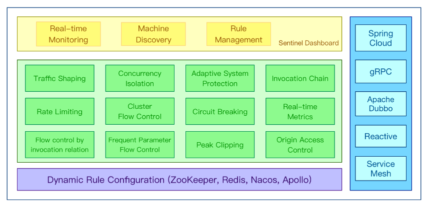
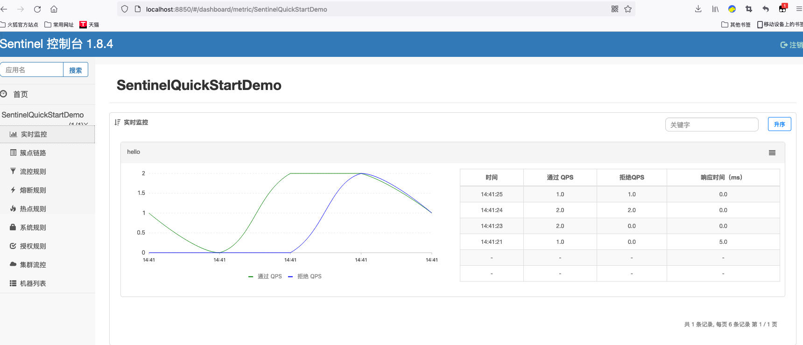
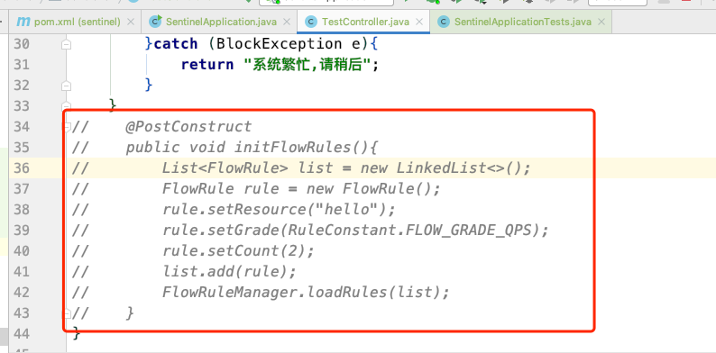
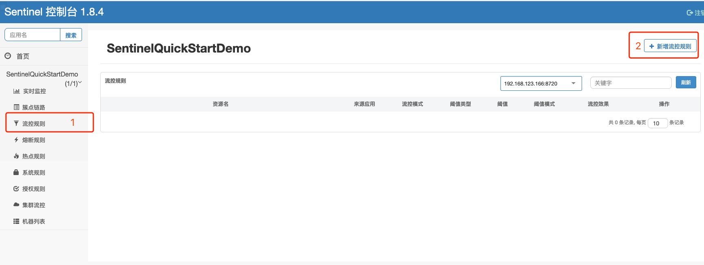
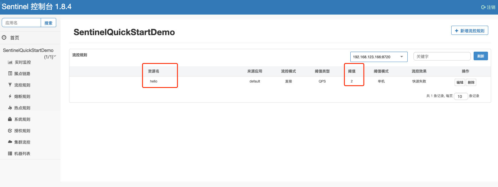
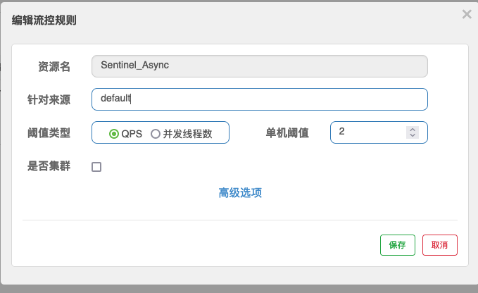
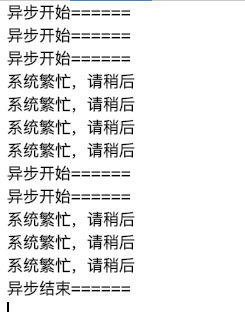

# SpringCloud alibaba Sentinel
[SpringCloud alibaba Sentinel](https://github.com/TianPuJun/springcloud-alibaba-note/tree/master/alibaba-sentinel)
# 流量控制&熔断降级产品对比

|| Sentinel | Hystrix | Resilience4j |
| -------- | -------- | ------- | ------------ |
|隔离策略| 信号量隔离（并发线程数隔离） | 线程池隔离/信号量隔离 | 信号量隔离 |
|熔断降级策略| 基于响应时间、异常比率、异常数 | 基于异常比率 | 基于异常比率、响应时间 |
|实时统计实现| 滑动窗口 | 滑动窗口 | Ring Bit Bufffer |
|动态规则配置| 支持多种数据源 | 支持多种数据源 | 有限支持 |
|扩展性| 多个扩展点 | 插件的形式 | 接口的形式 |
|基于注解的支持| 支持 | 支持 | 支持 |
|限流| 基于QPS，支持基于调用关系的限流 | 有限的支持 | Rate Limiter |
|流量整形| 支持预热模式、匀速器模式、预热派对模式 | 不支持 | 简单的Rate Limiter |
|系统自适应保护| 支持 | 不支持 | 不支持 |
|控制台| 提供开箱即用的控制台、可配置规则、查看秒级监控、机器发现 | 简单的监控查看 |

# Sentinel 介绍

## Sentinel 概述

Sentinel是阿里巴巴出品的面向分布式服务架构的轻量级流量控制组件，主要以流量为切入点，从限流、流量整形、熔断降级、系统负载保护等多个维度来保障微服务的稳定性

## Sentinel 组成

* 核心库：主要是指Java客户端，不依赖任何框架、库，能够运行与java7及以上的版本运行时环境，同时对Dubbo、Spring Cloud等框架也有较好的支持
* 控制台：控制台主要负责管理推送规则、监控、集群限流分配管理、机器发现等

## Sentinel 特性



## Sentinel 相关概念

### 资源

资源是Sentinel的关键概念。它可以是Java应用程序中的任何内容，例如，由应用程序提供的服务，或由应用程序调用的其它应用提供的服务，甚至可以是一段代码。只要通过Sentinel API定义的代码，就是资源、能够被Sentinel 保护起来。大部分情况下，可以使用方法签名，URL，甚至服务名称作为资源名来标示资源

### 规则

规则指的是围绕资源的实时状态设定的规则，可以包括流量控制规则、熔断降级规则以及系统保护规则。所有规则可以动态实时调整

## Sentinel 优势

* 友好的控制面板
* 支持实时监控
* 支持多种限流、支持QPS限流，线程数限流以及多种限流策略
* 支持多种降级模式、支持按平均返回时间降级，按多种异常数降级、按异常比率降级等
* 方便扩展开发，支持SPI模式对chain进行扩展
* 支持链路的关联、可以实现按照链路统计限流，系统保护，热门资源保护等


# SpringBoot+Sentinel

## SpringBoot 环境信息

* SpringBoot 2.1.4.RELEASE
* JDK8
* Sentinel 1.7.2

## 内置加载限流规则

* pom加入sentinel依赖

  ```text
  		<dependency>
  			<groupId>com.alibaba.csp</groupId>
  			<artifactId>sentinel-core</artifactId>
  			<version>1.7.2</version>
  		</dependency>
  ```

* 创建TestController 

  ```text
  @RestController
  public class TestController {
      @GetMapping("/hello")
      public String hello(){
      // 限流的资源名称
          try (Entry entry = SphU.entry("hello")){
              return "hello sentinel";
          }catch (BlockException e){
              return "系统繁忙，请稍后";
          }
      }
      @PostConstruct
      public void initFlowRules(){
          List<FlowRule> list = new LinkedList<>();
          FlowRule rule = new FlowRule();
          // 限流资源名称
          rule.setResource("hello");
          // 限流策略
          rule.setGrade(RuleConstant.FLOW_GRADE_QPS);
          // 限流数量定义QPS每秒能通过的请求个数
          rule.setCount(2);
          list.add(rule);
          // 加载限流规则
          FlowRuleManager.loadRules(list);
      }
  }
  ```

* 此时启动应用，访问资源hello，每秒慢速点击访问可以正常访问，如果快速点击出现系统繁忙，请稍后

  

  

通过上面我们也能看到限流规则是在代码中写好的， 如果后续要修改的话，需要重新编译非常的麻烦，现在Sentinel提供了一个控制台，通过控制台我们就能动态的修改限流规则，现在我们看下怎么使用Sentinel控制台来实现限流策略

## Sentinel 控制台启动

* 下载地址：https://github.com/alibaba/Sentinel/releases

* 启动

  ```text
  java -Dserver.port=8850 -jar sentinel-dashboard-1.8.4.jar
  ```

* 浏览器访问 localhost:8050 账号密码默认sentinel sentinel


## SpringBoot应用与Sentinel控制台绑定

* pom加入依赖

  ```text
  		<dependency>
  			<groupId>com.alibaba.csp</groupId>
  			<artifactId>sentinel-transport-simple-http</artifactId>
  			<version>1.7.2</version>
  		</dependency>
  ```

* JVM启动时添加参数

  ```text
  -Dcsp.sentinel.dashboard.server=localhost:8850
  -Dproject.name=SentinelQuickStartDemo
  ```

* 重启应用并通过浏览器访问 /hello接口几次，查看控制台中实时监控效果

  

* 动态设置限流规则

  * 首先取消代码中的规则设置，注释掉规则代码

  

  * 打开控制台设置限流规则

    

    

    

* 访问应用接口，查看限流规则是否生效
  

  

## Sentinel 定义资源的方式

Sentinel除了基本的定义资源的方式外，还有其它的定义资源的方式，具体如下：

* 抛出异常的方式定义资源
* 返回布尔值的方式定义资源
* 异步调用支持
* 注解方式调用支持
* 主流框架的默认适配

### 抛出异常的方式定义资源

Sentinel中的SphU包含try-catch风格的api。用这种方式，当资源发生限流之后会抛出BlockException。这个时候可以捕捉异常，进行限流之后的逻辑处理，而我们在上面就使用了这种方式进行定义资源，关键代码如下：

```text
// 使用限流规则监控保护资源
try (Entry entry = SphU.entry("hello")){
// 被保护的资源
            return "hello sentinel";
        }catch (BlockException e){
        // 被限流或者降级的处理
            return "系统繁忙,请稍后";
        }
```


### 返回布尔值的方式定义资源

* 定义资源保护访问

  ```text
  @RestController
  public class TestBooleanController {
      @GetMapping("/boolean")
      public boolean hello(){
          if (SphO.entry("Sentinel_Boolean")){
              try {
                  System.out.println("Hello Sentinel");
                  return true;
              }finally {
                  SphO.exit();
              }
          }else{
              // 限流降级的处理
              System.out.println("系统繁忙，请稍后");
              return false;
          }
      }
  
  }
  ```

  

* 新增限流规则

  

* 查看访问结果

  

  

### 异步调用支持方式

* 开启异步支持

  ```
  // @EnableAsync 开启异步支持
  @EnableAsync
  @SpringBootApplication
  public class SentinelApplication {
  
     public static void main(String[] args) {
        SpringApplication.run(SentinelApplication.class, args);
     }
  
  }
  ```

* 添加异步访问方法

  新建AcyncService方法

  ```text
  @Service
  public class AsyncService {
      @Async
      public void hello(){
          System.out.println("异步开始======");
          try {
              Thread.sleep(5000);
          }catch (InterruptedException e){
              e.printStackTrace();
          }
          System.out.println("异步结束======");
      }
  }
  
  ```

  

* 添加异步访问资源

  ```text
  @RestController
  public class TestAsyncController {
      @Autowired
      AsyncService asyncService;
      @GetMapping("/async")
      public void hello(){
          AsyncEntry asyncEntry = null;
          try {
              asyncEntry = SphU.asyncEntry("Sentinel_Async");
              asyncService.hello();
          }catch (BlockException e){
              System.out.println("系统繁忙，请稍后");
          }finally {
              if (asyncEntry != null ){
                  asyncEntry.exit();
              }
          }
          
      }
    
  }
  ```

  

* 添加限流规则

  

* 查看访问效果

  

### 注解方式调用支持

* 添加注解支持的依赖

  ```text
  		<dependency>
  			<groupId>com.alibaba.csp</groupId>
  			<artifactId>sentinel-annotation-aspectj</artifactId>
  			<version>1.7.2</version>
  		</dependency>
  ```

  

* 创建Aspect配置类

  ```text
  @Configuration
  public class AspectConfig {
      @Bean
      public SentinelResourceAspect sentinelResourceAspect(){
          return new SentinelResourceAspect();
      }
  }
  ```

  

* 创建限流访问资源代码

  ```text
  @RestController
  public class TestAnnController {
      @Autowired
      AsyncService asyncService;
      @SentinelResource(value = "Sentinel_Ann",blockHandler = "exceptionHandler")
      @GetMapping("/ann")
      public String hello(){
  
          return "Hello Sentinel";
      }
      public void exceptionHandler(BlockException e){
          e.printStackTrace();
          System.out.println("系统繁忙，请稍后");
      }
  
  }
  ```

  

### 主流框架的默认适配

为了减少开发的复杂程度，对大部分的主流框架，例如Web Servlet，Dubbo、Spring Cloud、gRPC、Spring WebFlx、Reactor等都做了适配，只需要引入对应的依赖就可以方便的整合Sentinel

